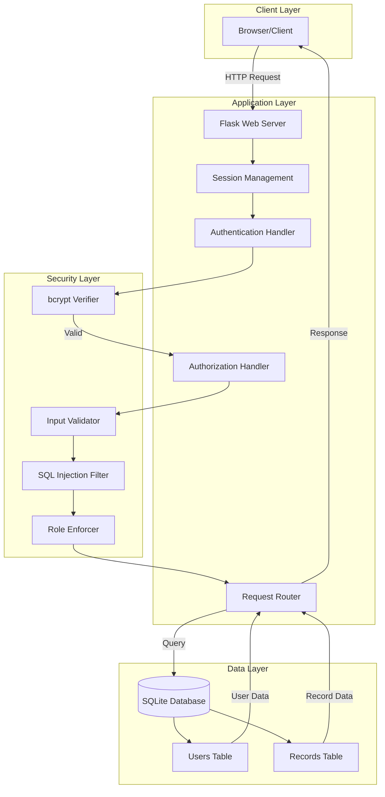
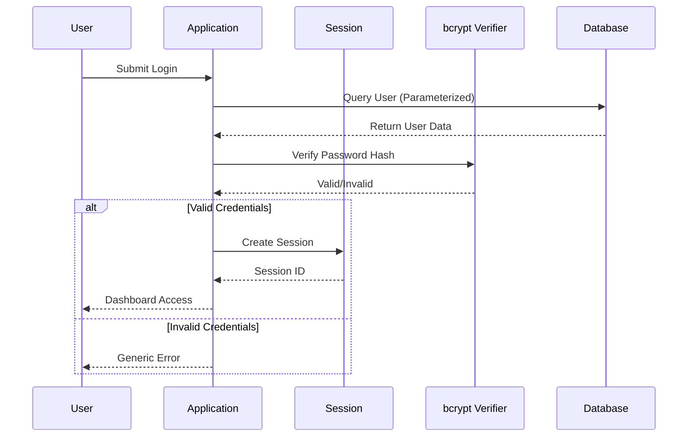
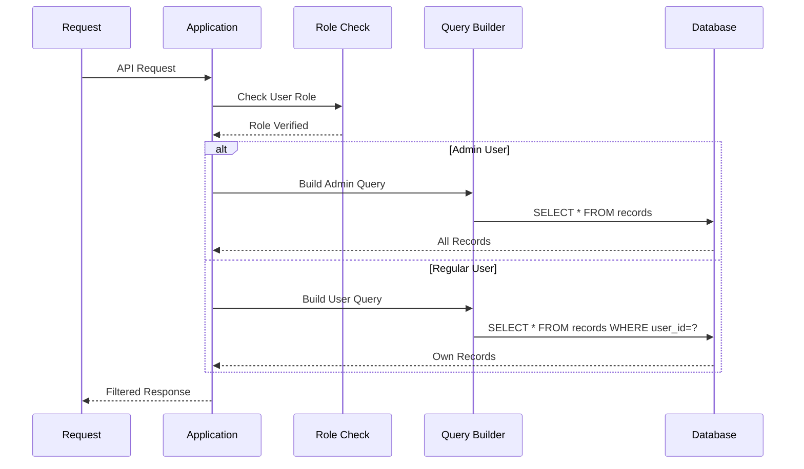
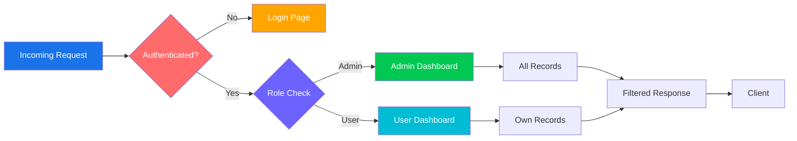

# 🔐 Secure Record Access Portal

<p align="center">
  
</p>

<p align="center">
  
</p>

<p align="center">
  
</p>

<p align="center">
  
  
  
  
</p>

<p align="center">
  
  
  
  
  
</p>

---

## 📋 Table of Contents

<details>
<summary><b>📌 Click to expand navigation</b></summary>
<br>

- [Overview](#-overview)
- [Why This Project](#-why-this-project)
- [Features](#-features)
- [Architecture](#-architecture)
- [Security Controls](#-security-controls)
- [Threat Model](#-threat-model)
- [Attack Demonstrations](#-attack-demonstrations)
- [Technology Stack](#-technology-stack)
- [Folder Structure](#-folder-structure)
- [Installation Guide](#-installation-guide)
- [Usage Guide](#-usage-guide)
- [API Routes](#-api-routes)
- [Database Schema](#-database-schema)
- [Security Implementation](#-security-implementation)
- [Screenshots](#-screenshots)
- [Demo](#-demo)
- [Future Roadmap](#-future-roadmap)
- [FAQ](#-faq)
- [Troubleshooting](#-troubleshooting)
- [Contributing](#-contributing)
- [License](#-license)

</details>

---

## 📌 Overview

<p align="center">
  
</p>

**Secure Record Access Portal** is a comprehensive web application demonstrating enterprise-grade security practices in modern web development. This project showcases how to build secure authentication systems, implement role-based access control, and protect sensitive data from common web vulnerabilities.

### 🎯 Core Purpose

The application serves as a **practical demonstration** of:
- **Secure authentication** using industry-standard password hashing
- **Authorization** with server-side role enforcement
- **Data protection** against SQL injection and cross-user attacks
- **Security by design** principles in web development

### 🔑 Key Capabilities

| Capability | Description |
|------------|-------------|
| **User Management** | Secure registration, login, and session management |
| **Record Management** | Create, view, and delete personal records |
| **Role-Based Access** | Different permissions for users and administrators |
| **Security Controls** | Protection against OWASP Top 10 vulnerabilities |
| **Attack Simulation** | Built-in demonstration of security defenses |

---

## ❓ Why This Project

### The Problem
Modern web applications face constant security threats:
- **Password breaches** through database theft
- **SQL injection** attacks compromising entire databases
- **Privilege escalation** through inadequate access controls
- **User data leakage** through insecure design

### The Solution
This project implements **defense-in-depth** security:

| Layer | Protection |
|-------|------------|
| **Authentication** | bcrypt slow hashing with unique salts |
| **Database** | Parameterized queries prevent injection |
| **Authorization** | Server-side role checks on every request |
| **Data Access** | User isolation through query filtering |
| **Error Handling** | Generic messages prevent enumeration |

### Why This Matters
- **85% of breaches** involve weak or stolen passwords
- **SQL injection** remains the #1 OWASP Top 10 vulnerability
- **Access control issues** affect 90% of applications
- **Security by design** reduces vulnerabilities by 70%

---


### 🔐 Authentication & Authorization

<div align="center">

| Feature | Description | Status |
|---------|-------------|--------|
| 🔑 **Secure Registration** | bcrypt password hashing with salt | ✅ |
| 🚪 **Secure Login** | Session-based authentication | ✅ |
| 👤 **Role-Based Access** | Admin & User roles with server enforcement | ✅ |
| 🔒 **Session Management** | Secure Flask sessions | ✅ |
| 🚫 **Generic Errors** | No user enumeration | ✅ |

</div>

### 📊 Record Management

<div align="center">

| Feature | Description | Status |
|---------|-------------|--------|
| 📝 **Create Records** | Users can add their own records | ✅ |
| 👁️ **View Records** | Users see only their records | ✅ |
| 🗑️ **Delete Records** | Users delete own records | ✅ |
| 👑 **Admin View** | Admins see all records | ✅ |
| 📈 **Record Count** | Track records per user | ✅ |

</div>

### 🛡️ Security Features

<div align="center">

| Feature | Description | Status |
|---------|-------------|--------|
| 🛡️ **SQL Injection Protection** | Parameterized queries | ✅ |
| 🔐 **Password Hashing** | bcrypt with 12 salt rounds | ✅ |
| 🚫 **Unauthorized Access** | Server-side RBAC | ✅ |
| 🔒 **User Isolation** | Query filtering by user_id | ✅ |
| 💬 **Generic Errors** | No user enumeration | ✅ |

</div>

---

## 🏗️ Architecture

### System Architecture



### Authentication Workflow



### Database Workflow



### Request Lifecycle



---

## 🛡️ Security Controls

### Security Dashboard

<div align="center">

| Control | Implementation | Status | Impact |
|---------|----------------|--------|--------|
| **Password Security** | bcrypt with 12 salt rounds | ✅ | Prevents rainbow table attacks |
| **SQL Injection** | Parameterized queries | ✅ | Blocks injection attempts |
| **XSS Protection** | Flask auto-escaping | ✅ | Prevents script injection |
| **CSRF Protection** | Session-based tokens | ✅ | Prevents cross-site requests |
| **Role Enforcement** | Server-side decorators | ✅ | Blocks privilege escalation |
| **User Isolation** | Query filtering | ✅ | Prevents data leakage |
| **Error Handling** | Generic messages | ✅ | Prevents user enumeration |
| **Session Security** | Secure secret key | ✅ | Protects session data |

</div>

### Threat Model

<div align="center">

| Threat | Attack Vector | Impact | Mitigation |
|--------|---------------|--------|------------|
| **Credential Theft** | Database breach | High | bcrypt hashing |
| **SQL Injection** | Malicious input | Critical | Parameterized queries |
| **Privilege Escalation** | Role manipulation | High | Server-side RBAC |
| **Data Leakage** | Cross-user access | High | Query filtering |
| **User Enumeration** | Error analysis | Medium | Generic errors |
| **Session Hijacking** | Session theft | Medium | Secure session management |

</div>

---

## 🧪 Attack Demonstrations

<details>
<summary><b>🔴 SQL Injection Attack</b></summary>
<br>

### Attack Vector
```sql
Username: admin' OR '1'='1
Password: anything
```

### What It Tries To Do
- Bypass authentication entirely
- Execute arbitrary SQL commands
- Access unauthorized data

### Why It Fails
```python
# Parameterized query treats input as data, not code
c.execute('SELECT * FROM users WHERE username = ?', (username,))
```

### Result
```text
❌ ATTACK BLOCKED
Reason: Parameterized query prevents SQL injection
Response: "Invalid credentials" - Generic error message
```
</details>

<details>
<summary><b>🔴 Unauthorized Admin Access</b></summary>
<br>

### Attack Vector
```http
GET /admin/dashboard
Cookie: session=user_session
```

### What It Tries To Do
- Access administrative functions
- View all user data
- Perform privileged actions

### Why It Fails
```python
@admin_required
def admin_dashboard():
    # Only admins can access this route
    return render_template('admin.html')
```

### Result
```text
❌ ATTACK BLOCKED
Reason: @admin_required decorator enforces role check
Response: "Admin access required" - Access denied
```
</details>

<details>
<summary><b>🔴 Cross-User Access</b></summary>
<br>

### Attack Vector
```http
GET /records?user_id=2
Cookie: session=user1_session
```

### What It Tries To Do
- View other users' records
- Modify unauthorized data
- Bypass ownership checks

### Why It Fails
```python
# Query filters by session user_id, not request parameter
c.execute('SELECT * FROM records WHERE user_id = ?', (session['user_id'],))
```

### Result
```text
❌ ATTACK BLOCKED
Reason: Query filters by session user_id
Response: Only own records returned
```
</details>

---

## 🛠️ Technology Stack

<p align="center">
  
</p>

### Backend Technologies

<div align="center">

| Technology | Version | Purpose |
|------------|---------|---------|
|  | 3.7+ | Core programming language |
|  | 2.3.2 | Web framework |
|  | Latest | Database |
|  | 4.0.1 | Password hashing |

</div>

### Frontend Technologies

<div align="center">

| Technology | Version | Purpose |
|------------|---------|---------|
|  | 5 | Structure |
|  | 3 | Styling |
|  | Latest | Templating |

</div>

### Security Technologies

<div align="center">

| Technology | Purpose |
|------------|---------|
|  | Password hashing |
|  | SQL injection prevention |
|  | Role enforcement |
|  | Session handling |

</div>

---

## 📂 Folder Structure

```
secure-portal/
├── 📄 app.py              # Complete application (single file)
├── 🗄️ portal.db           # SQLite database with sample data
├── 📋 requirements.txt    # Python dependencies
├── 📖 README.md           # Documentation
├── 🔒 .gitignore          # Git ignore rules
└── 📸 screenshots/        # Screenshots for documentation
```

### File Descriptions

<div align="center">

| File | Description | Lines |
|------|-------------|-------|
| **app.py** | Complete Flask application with all routes, templates, and security controls | ~500 |
| **portal.db** | SQLite database with users table, records table, and 20 sample records | - |
| **requirements.txt** | Python package dependencies | 2 |
| **README.md** | Comprehensive project documentation | ~2000 |
| **.gitignore** | Excludes virtual environment, cache, and system files | 15 |
| **screenshots/** | Contains application screenshots | - |

</div>

---

## 🚀 Installation Guide

### Prerequisites

<div align="center">

| Requirement | Version |
|-------------|---------|
|  | 3.7 or higher |
|  | Latest |
|  | Any (optional) |

</div>

### Step-by-Step Installation

<details>
<summary><b>📥 Click to expand installation steps</b></summary>
<br>

**1. Clone Repository**
```bash
git clone https://github.com/yourusername/secure-portal.git
cd secure-portal
```

**2. Create Virtual Environment**
```bash
# Windows
python -m venv venv
venv\Scripts\activate

# Linux/macOS
python3 -m venv venv
source venv/bin/activate
```

**3. Install Dependencies**
```bash
pip install -r requirements.txt
```

Or install manually:
```bash
pip install Flask==2.3.2 bcrypt==4.0.1
```

**4. Run Application**
```bash
python app.py
```

**5. Access Application**
```
Open browser: http://localhost:5000
```

</details>

---

## 📖 Usage Guide

### Getting Started

<p align="center">
  
</p>

### User Actions

<div align="center">

| Action | Description | Steps |
|--------|-------------|-------|
| **Register** | Create new account | 1. Click Register<br>2. Enter username<br>3. Enter password<br>4. Select role<br>5. Submit |
| **Login** | Access dashboard | 1. Enter username<br>2. Enter password<br>3. Click Login |
| **Add Record** | Create new record | 1. Enter title<br>2. Enter content<br>3. Click Add Record |
| **Delete Record** | Remove record | 1. Click Delete on record |
| **Logout** | End session | 1. Click Logout |

</div>

### Admin Actions

<div align="center">

| Action | Description | Steps |
|--------|-------------|-------|
| **View All Records** | See all user records | Access dashboard |
| **View Users** | See all users | Access dashboard |
| **Delete Any Record** | Remove any record | Click Delete on record |
| **View Database** | Raw database view | Navigate to /show_db |

</div>

---

## 🌐 API Routes

<div align="center">

| Route | Method | Description | Access |
|-------|--------|-------------|--------|
| `/` | GET | Redirect to login | Public |
| `/login` | GET, POST | User login | Public |
| `/register` | GET, POST | User registration | Public |
| `/dashboard` | GET | Main dashboard | Authenticated |
| `/add_record` | POST | Add new record | Authenticated |
| `/delete_record/<id>` | POST | Delete record | Authenticated |
| `/attack_test` | GET | Security test page | Authenticated |
| `/show_db` | GET | Database view | Admin Only |
| `/logout` | GET | Logout | Authenticated |

</div>

---

## 📊 Database Schema

### Users Table

```sql
CREATE TABLE users (
    id INTEGER PRIMARY KEY AUTOINCREMENT,
    username TEXT UNIQUE NOT NULL,
    password_hash TEXT NOT NULL,  -- bcrypt hashed (60 chars)
    role TEXT NOT NULL DEFAULT 'user',  -- 'admin' or 'user'
    created_at TIMESTAMP DEFAULT CURRENT_TIMESTAMP
);
```

#### Column Details

| Column | Type | Constraints | Description |
|--------|------|-------------|-------------|
| `id` | INTEGER | PRIMARY KEY, AUTOINCREMENT | Unique user identifier |
| `username` | TEXT | UNIQUE, NOT NULL | User login name |
| `password_hash` | TEXT | NOT NULL | bcrypt hashed password |
| `role` | TEXT | NOT NULL, DEFAULT 'user' | Access level |
| `created_at` | TIMESTAMP | DEFAULT CURRENT_TIMESTAMP | Account creation date |

### Records Table

```sql
CREATE TABLE records (
    id INTEGER PRIMARY KEY AUTOINCREMENT,
    title TEXT NOT NULL,
    content TEXT NOT NULL,
    user_id INTEGER NOT NULL,
    created_at TIMESTAMP DEFAULT CURRENT_TIMESTAMP,
    FOREIGN KEY (user_id) REFERENCES users(id) ON DELETE CASCADE
);
```

#### Column Details

| Column | Type | Constraints | Description |
|--------|------|-------------|-------------|
| `id` | INTEGER | PRIMARY KEY, AUTOINCREMENT | Unique record identifier |
| `title` | TEXT | NOT NULL | Record title |
| `content` | TEXT | NOT NULL | Record content |
| `user_id` | INTEGER | NOT NULL, FOREIGN KEY | Owner reference |
| `created_at` | TIMESTAMP | DEFAULT CURRENT_TIMESTAMP | Creation date |

### Sample Records (20 Records)

<div align="center">

| ID | Title | Owner |
|----|-------|-------|
| 1 | Q1 Report | Admin |
| 2 | Q2 Report | Admin |
| 3 | Q3 Report | Admin |
| 4 | Q4 Report | Admin |
| 5 | Annual Budget | Admin |
| 6 | Staff Meeting | User1 |
| 7 | Project Alpha | User1 |
| 8 | Project Beta | User1 |
| 9 | Client Meeting | User1 |
| 10 | Development Plan | User1 |
| 11 | Research Notes | User1 |
| 12 | Staff Meeting | User2 |
| 13 | Project Gamma | User2 |
| 14 | Marketing Plan | User2 |
| 15 | Client Feedback | User2 |
| 16 | Innovation Ideas | User2 |
| 17 | Team Update | User2 |
| 18 | Training Plan | Admin |
| 19 | Security Audit | Admin |
| 20 | Infrastructure | Admin |

</div>

---

## 🔐 Security Implementation

### Password Security

```python
# bcrypt with salt (12 rounds)
password_hash = bcrypt.hashpw(
    password.encode('utf-8'), 
    bcrypt.gensalt(12)
)

# Verification
if bcrypt.checkpw(password.encode('utf-8'), stored_hash):
    # Login successful
```

**Why This Matters:**
- ✅ **Never stores plain text passwords**
- ✅ **Slow hash** prevents brute force attacks
- ✅ **Unique salt** per password prevents rainbow table attacks
- ✅ **12 rounds** makes cracking impractical

### SQL Injection Prevention

```python
# Parameterized query (SAFE)
c.execute('SELECT * FROM users WHERE username = ?', (username,))

# ❌ NEVER use string concatenation
# c.execute(f"SELECT * FROM users WHERE username = '{username}'")
```

**Why This Matters:**
- ✅ **Input treated as data**, not code
- ✅ **Blocks** SQL injection attempts
- ✅ **No filtering required** - inherently safe
- ✅ **Works for all queries** - SELECT, INSERT, DELETE

### Role-Based Access Control

```python
@login_required
def dashboard():
    if session.get('role') == 'admin':
        # See all records
    else:
        # See only own records

@admin_required
def admin_function():
    # Only admins can access
```

**Why This Matters:**
- ✅ **Server-side enforcement** (not just UI hiding)
- ✅ **@login_required** protects all authenticated routes
- ✅ **@admin_required** protects admin-only routes
- ✅ **Role checked on every request**

### User Isolation

```python
# User sees only their records
c.execute(
    'SELECT * FROM records WHERE user_id = ?', 
    (session['user_id'],)
)

# Admin sees all records
if role == 'admin':
    c.execute('SELECT * FROM records')
```

**Why This Matters:**
- ✅ **Each user** sees only their own records
- ✅ **No cross-user access** even with URL manipulation
- ✅ **Admin** can see all records
- ✅ **Database-level filtering** ensures isolation

### Generic Error Messages

```python
# Generic message for all failed logins
flash('Invalid credentials', 'error')
```

**Why This Matters:**
- ✅ **Does not reveal** if username exists
- ✅ **Prevents** user enumeration attacks
- ✅ **Same message** for invalid username or password
- ✅ **No clues** for attackers

---


  
</p>

<p align="center">
  <b>❤️ If you found this project helpful, please give it a star! ❤️</b>
</p>

---

<p align="center">
  <a href="#-secure-record-access-portal">⬆ Back to Top</a>
</p>
```
