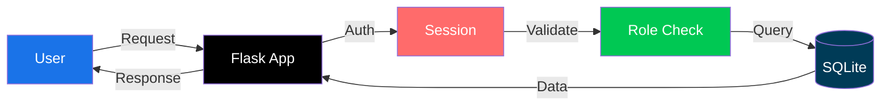

# 🔐 Secure Record Access Portal

<p align="center">
  
</p>

<p align="center">
  
</p>

<p align="center">
  
  
  
</p>

---

<p align="center">
  
</p>

## 📌 Overview

> A secure institutional portal demonstrating essential security practices for protecting sensitive records. Built with Flask, SQLite, and bcrypt.

<p align="center">
  
  
  
  
</p>

---

## 🎯 Objectives

<table>
  <tr>
    <td>🔐 <b>Secure Storage</b></td>
    <td>bcrypt with salt for password hashing</td>
  </tr>
  <tr>
    <td>🛡️ <b>SQL Injection Prevention</b></td>
    <td>Parameterized queries throughout</td>
  </tr>
  <tr>
    <td>👤 <b>RBAC</b></td>
    <td>Server-side role enforcement</td>
  </tr>
  <tr>
    <td>🔒 <b>User Isolation</b></td>
    <td>Users see only their records</td>
  </tr>
</table>

---

## 🚀 Quick Start

```bash
# Clone
git clone <your-repo-url>
cd secure-portal

# Setup
python -m venv venv
source venv/bin/activate  # Windows: venv\Scripts\activate

# Install
pip install -r requirements.txt

# Run
python app.py
```

<p align="center">
  
</p>

---

## 🔐 Default Credentials

<p align="center">
  <table>
    <tr>
      <th>👑 Admin</th>
      <td>admin</td>
      <td>admin123</td>
    </tr>
    <tr>
      <th>👤 User 1</th>
      <td>user1</td>
      <td>user123</td>
    </tr>
    <tr>
      <th>👤 User 2</th>
      <td>user2</td>
      <td>user123</td>
    </tr>
  </table>
</p>

---

## 🛡️ Security Features

<table align="center">
  <tr>
    <td align="center">🔐</td>
    <td><b>Password Storage</b></td>
    <td>bcrypt with 12 salt rounds</td>
    <td>✅</td>
  </tr>
  <tr>
    <td align="center">🛡️</td>
    <td><b>SQL Injection</b></td>
    <td>Parameterized queries</td>
    <td>✅</td>
  </tr>
  <tr>
    <td align="center">👤</td>
    <td><b>Role Based Access</b></td>
    <td>Server-side decorators</td>
    <td>✅</td>
  </tr>
  <tr>
    <td align="center">🔒</td>
    <td><b>User Isolation</b></td>
    <td>Query filtering by user_id</td>
    <td>✅</td>
  </tr>
  <tr>
    <td align="center">💬</td>
    <td><b>Error Messages</b></td>
    <td>Generic (no user enumeration)</td>
    <td>✅</td>
  </tr>
</table>

---

## 🧪 Attack Demonstration

<details>
  <summary><b>🔴 Attack 1: SQL Injection</b></summary>
  <br>
  <b>Attempt:</b><br>
  <code>Username: admin' OR '1'='1</code><br>
  <code>Password: anything</code><br><br>
  <b>Result:</b> ❌ <b>BLOCKED</b> - Parameterized query prevents injection
</details>

<details>
  <summary><b>🔴 Attack 2: Unauthorized Admin Access</b></summary>
  <br>
  <b>Attempt:</b><br>
  <code>Regular user tries /show_db</code><br><br>
  <b>Result:</b> ❌ <b>BLOCKED</b> - @admin_required decorator enforces role
</details>

<details>
  <summary><b>🔴 Attack 3: Cross-User Access</b></summary>
  <br>
  <b>Attempt:</b><br>
  <code>user1 tries to view user2's records</code><br><br>
  <b>Result:</b> ❌ <b>BLOCKED</b> - Query filters by session user_id
</details>

---

## 🏗️ Architecture



---

## 📂 Project Structure

```
secure-portal/
├── 📄 app.py              # Complete application
├── 🗄️ portal.db           # SQLite database
├── 📋 requirements.txt    # Dependencies
├── 📖 README.md           # Documentation
├── 🔒 .gitignore          # Git rules
└── 📸 screenshots/        # Screenshots
```

---

## ✅ Task Completion

| Task | Status | Progress |
|------|--------|----------|
| Task 1: Data Model & Threats | ✅ | ████████████ 100% |
| Task 2: Secure Storage | ✅ | ████████████ 100% |
| Task 3: Secure Login | ✅ | ████████████ 100% |
| Task 4: Server Permissions | ✅ | ████████████ 100% |
| Task 5: Attack Testing | ✅ | ████████████ 100% |
| Task 6: Documentation | ✅ | ████████████ 100% |

---

## 📊 Database Schema

```sql
-- Users Table
CREATE TABLE users (
    id INTEGER PRIMARY KEY,
    username TEXT UNIQUE NOT NULL,
    password_hash TEXT NOT NULL,  -- bcrypt hashed
    role TEXT DEFAULT 'user',
    created_at TIMESTAMP
);

-- Records Table
CREATE TABLE records (
    id INTEGER PRIMARY KEY,
    title TEXT NOT NULL,
    content TEXT NOT NULL,
    user_id INTEGER NOT NULL,
    created_at TIMESTAMP,
    FOREIGN KEY (user_id) REFERENCES users(id)
);
```

---

## 🎬 Video Demonstration

<p align="center">
  <a href="https://youtu.be/your-video-link">
    
  </a>
</p>

**Coverage:**
- ✅ Registration & Login
- ✅ SQL Injection attempt (blocked)
- ✅ Role-Based Access Control
- ✅ User Isolation
- ✅ Admin Panel
- ✅ Attack Test Page

---

## 🐛 Troubleshooting

<details>
  <summary><b>Port 5000 in use</b></summary>
  <br>
  <code>python app.py --port=5001</code>
</details>

<details>
  <summary><b>Database issues</b></summary>
  <br>
  <code>del portal.db</code> (Windows)<br>
  <code>rm portal.db</code> (Linux)<br>
  <code>python app.py</code> (regenerates)
</details>

<details>
  <summary><b>Virtual env not activating</b></summary>
  <br>
  <code>Set-ExecutionPolicy RemoteSigned -Scope CurrentUser</code>
</details>


<p align="center">
  
</p>

<p align="center">
  <b>⭐ If you found this useful, please give it a star! ⭐</b>
</p>

<p align="center">
  
</p>
```

---
