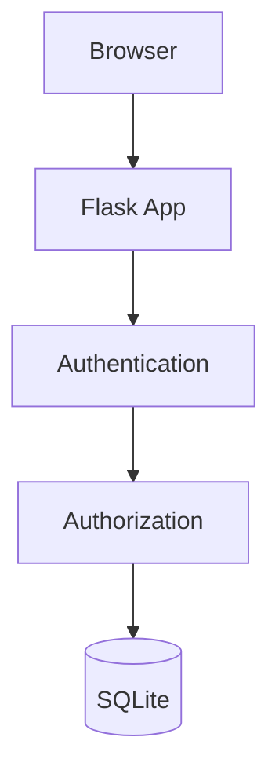
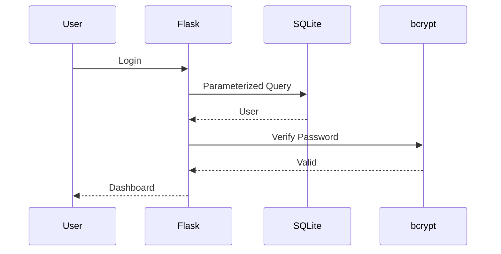

# 🔐 Secure Record Access Portal

<p align="center">

</p>

<p align="center">


</p>

---

# 📌 Overview

A secure institutional portal demonstrating secure authentication, authorization and protection against common attacks.

## ✨ Features

- Secure Login
- Registration
- bcrypt Password Hashing
- SQL Injection Protection
- Role Based Access Control
- User Isolation
- Attack Demonstration
- SQLite Database

## 🏗 Architecture



## 🔄 Login Workflow



## 🛡 Security Dashboard

| Threat | Protection | Status |
|---|---|---|
| SQL Injection | Parameterized Queries | ✅ |
| Password Theft | bcrypt | ✅ |
| Unauthorized Access | RBAC | ✅ |
| Cross User Access | Ownership Checks | ✅ |

## 📂 Structure

```text
secure-portal/
├── app.py
├── portal.db
├── requirements.txt
├── README.md
├── screenshots/
└── .gitignore
```

## 🚀 Installation

```bash
git clone <repo>
cd secure-portal
python -m venv venv
```

Activate:

Windows

```bash
venv\Scripts\activate
```

Linux

```bash
source venv/bin/activate
```

Install:

```bash
pip install -r requirements.txt
python app.py
```

Open:

http://localhost:5000

## 🧪 Security Tests

<details>
<summary>SQL Injection</summary>

Attempt:
`admin' OR '1'='1`

Expected: Blocked

</details>

<details>
<summary>Admin Access</summary>

Normal user cannot access admin routes.

</details>

<details>
<summary>User Isolation</summary>

Users can only access their own records.

</details>

## 📸 Screenshots

Add screenshots:

- login.png
- register.png
- dashboard.png
- admin.png
- attack_test.png

## 🎥 Demo

Record:
1. Registration
2. Login
3. SQL Injection blocked
4. RBAC
5. User isolation
6. Admin panel

## 🗺 Roadmap

- MFA
- JWT
- Docker
- HTTPS
- Audit Logs

## 📜 License

Educational project for SIH 2026.

<p align="center">
⭐ If you like this project, consider giving it a star!
</p>
